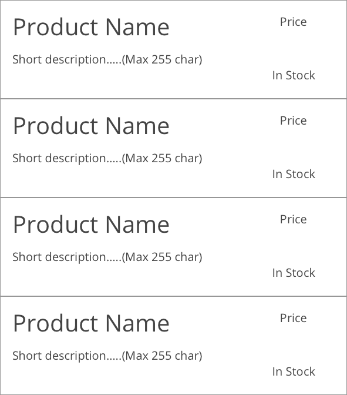
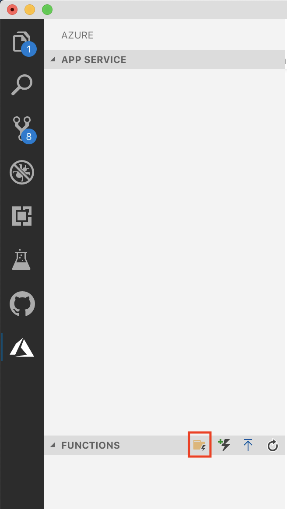

# Hackathon walkthrough

In this hackathon, we're going to take the example of an existing e-commercce application that we will create a GraphQL proof of concept for. We recommend you start out with one feature of your application and creating a schema that would serve that data. 

## Use case

For our first GraphQL feature, we're going to use the Recommended Products List that is displayed to our users (we'll ignore the styling for this POC)



Now we need to design on GraphQL schema which can be challenging sometimes. One of the big advantages of GraphQL is having the ability to break the tight coupling between consumers and provider of the data served by your GraphQL server. I recommend you start with the ideal schema for the consumers of data and work towards that. Below is an example of the ideal query for our feature:


## Getting started

### Setup

1. We're going to use [json-server]() for the fake REST API that we'll connect with. Let's set that project up:

```shell
mkdir products-json-server
cd products-json-server
npm install -g json-server
>db.json
code db.json
```

2. Then we'll need to create a structure:

```json
{
	"suggestedProducts": [
		{
			"email": "testymctest@test.com",
			"name": "Product A",
			"shortDesc": "Product description",
			"price": 1.99,
			"inStock": true
		},
		{
			"email": "testymctest@test.com",
			"name": "Product B",
			"shortDesc": "Product description",
			"price": 10.00,
			"inStock": false
		}
	]
}
```

3. Now let's run the json-server in the background

```shell
json-server --watch db.json --port 8000
```

### Exposing our first GraphQL schema

1. First we'll need to create our server in the most simplest form we can. We'll transfer it over to Azure Functions to host later on. Let's setup a new server project:

```shell
mkdir products-apollo-server
cd products-apollo-server
mkdir src
>src/index.js
npm init 
```

2. Now we'll need to install our packages for GraphQL and Apollo Server:

```shell
npm install graphql apollo-server apollo-datasource-rest
```

3. Now let's create our first data source:

```shell
mkdir datasources
>datasources/jsonServiceDatasource.js
code datasources/jsonServiceDatasource.js
```

3a. Apollo Server has the `RESTDataSource` built into it that has CRUD methods implemented for you to easily expose a REST API.

```javascript
const { RESTDataSource } = require('apollo-datasource-rest');

module.exports = class jsonServiceDatasource extends RESTDataSource {
    constructor() {
        super();
        this.baseURL = 'http://localhost:8000/';
    }

    async getUserProducts(email)  {
        return await this.get(`suggestedProducts?email=${email}`, null, { cacheOptions: { ttl: 60 } });
    }
};
```

4. Now let's open our `index.js` file and build out our server:

	* Add imports

	```javascript
	const { ApolloServer, gql, AuthenticationError } = require('apollo-server');
	const jsonServiceDatasource = require('./datasources/jsonServiceDatasource');
	```

	* Define Schema:

	```javascript
	const typeDefs = gql`
		type Query {
			me: User
		}
		type User {
			email: String!
			sugProducts: [Product]
		}
		type Product {
			name: String
			shortDesc: String
			price: Float
			inStock: Boolean
		}
	`;
	```

	* Define Resolvers:

	```javascript
	const resolvers = {
		Query: {
			me: async (root, { start, take }, context) => {
				let email = context.email;
				if (email) {
					let results = await context.dataSources.jsonServiceDatasource.getUserProducts(email);
					return {email: email, sugProducts: results};
				} else {
					return new AuthenticationError();
				}
			}
		}
	};
	```

	* Create your server:

	```javascript
	const server = new ApolloServer({
		typeDefs,
		resolvers,
		dataSources: () => ({
			jsonServiceDatasource: new jsonServiceDatasource()
		}),
		context: ({ req }) => {
			if (req) {
				return { email: req.headers.email };
			}
		}
	});
	```

	* Have our server listen for requests:

	```javascript
	server.listen().then(({ url }) => {
		console.log(`🚀  Server ready at ${url}`);
	});
	```

5. Now start your server!

```shell
node src/index.js
```

6. Navigate to [http:/localhost:4000](http:/localhost:4000)

### Moving the project into Azure Functions

1. Let's create a new folder and initialize the project with the VS Code extension for Azure Functions



2. Walk through the selection and create a Javascript function with an `HttpTrigger` named `graphql` and `Anonymous`.

3. We'll need to copy our `datasources` folder into the root of this project

4. Next we'll need to replace our `index.js` with what we previously created. 

5. Now we'll need to install the `apollo-server-azure-functions` package to get the handler:

```shell
npm install graphql apollo-server apollo-server-azure-functions apollo-datasource-rest
```

6. We'll need to change our imports statement:

```javascript
const { ApolloServer, gql, AuthenticationError } = require('apollo-server-azure-functions');
```

7. We'll need to change the `context` function in the `ApolloServer` constructor because of how Azure Functions handles the context:

```javascript
context: ({ request, context }) => {
	if (context) {
		return { email: context.req.headers.email };
	}
}
```

8. Now we'll just need to remove our listener and export our Apollo Server handler for Azure Functions:

```javascript
module.exports = server.createHandler();
```

9. Now we'll need our `HttpTrigger` to support returning GraphQL Playground. Open the `function.json` and modify what it returns to be like below:

```json
{
	"disabled": false,
	"bindings": [
		{
			"authLevel": "anonymous",
			"type": "httpTrigger",
			"direction": "in",
			"name": "req",
			"route": "graphql",
			"methods": [
				"get",
				"post"
			]
		},
		{
			"type": "http",
			"direction": "out",
			"name": "$return"
		}
	]
}
```

9 - optional. I like to make my GraphQL endpoints not have `api`. If you feel the same, open the `host.json` and make it so:

```json
{
	"version": "2.0",
	"extensions": {
		"http": {
			"routePrefix": ""
		}
	}
}
```

10. Last we'll need to setup CORS for our local settings (this is also where you can change the port). Open your `local.settings.json` file:
```
{
  "IsEncrypted": false,
  "Values": {
    "AzureWebJobsStorage": "",
    "FUNCTIONS_WORKER_RUNTIME": "node"
  },
  "Host": {
    "LocalHttpPort": 7071,
    "CORS": "*"
  }
}

```

11. Open debug tab and press play button. You should see the url print in the integrated console to open.

11 - optional. Try hosting in Azure Functions with the VS Code extension. It's very easy to push into the cloud, but you'll need to change your `index.js` to provide mocked data:

```javascript
const { ApolloServer, gql } = require('apollo-server-azure-functions');

const typeDefs = gql`
	type Query {
		me: User
	}
	type User {
		email: String!
		sugProducts: [Product]
	}
	type Product {
		name: String
		shortDesc: String
		price: Float
		inStock: Boolean
	}
`;

const server = new ApolloServer({
	typeDefs,
	mocks: true,
	cors: {
        origin: '*',            // <- allow request from all domains
		credentials: false
	}
});

module.exports = server.createHandler();
```

### Moving on to the client section

Now that we have a server running with our GraphQL Schema, let's create the client application.

1. Create the shell react app:

```shell
mkdir products-graphql-client
cd products-graphql-client
npx create-react-app .
mkdir src/components
npm install graphql graphql-tag apollo-client apollo-cache-inmemory apollo-link-context apollo-link-http react-apollo
```

2. Let's add our Apollo Client to our project, open up the index.js and change it to be like below :

```javascript
import React from 'react';
import ReactDOM from 'react-dom';
import './index.css';
import App from './App';

import { ApolloClient } from 'apollo-client';
import { InMemoryCache } from 'apollo-cache-inmemory';
import { HttpLink } from 'apollo-link-http';
import { setContext } from 'apollo-link-context';
import { ApolloProvider } from '@apollo/react-hooks';

const httpLink = new HttpLink({ uri: 'http://localhost:7071/graphql' });

const authLink = setContext((_, { headers }) => {
	return {
		headers: {
			...headers,
			email: "testymctest@test.com"
		}
	}
});

const client = new ApolloClient({
    link: authLink.concat(httpLink),
    cache: new InMemoryCache(),
    name: 'ecommerce-web',
    version: 1.0
});

ReactDOM.render(
	<ApolloProvider client={client}>
		<App />
	</ApolloProvider>,
	document.getElementById('root'));
```

3. Now we're going to create our first component that will use a GraphQL query:

```shell
>src/components/RecommendedProductsQuery.js
```

4. Add our component and query

```javascript
import React, { Component } from 'react';
import { Query } from 'react-apollo';
import gql from 'graphql-tag';

const RecommendedProductsQuery = gql`
	query MyRecommendations {
		me {
			sugProducts {
				name
				shortDesc
				price
				inStock
			}
		}
	}
`;

export class RecommendedProductsList extends Component {
	render = () => {
		return (
			<Query query={RecommendedProductsQuery}>
				{({ data, loading, error }) => {
					if (loading) return <p className="loading">loading...</p>;
					if (error) return <p>ERROR</p>;

					return (
						<ul className="productList">
							{data.me.sugProducts.map(product => {
								return (
									<li key={product.name}>
										<div>
											<p><b>{product.name}</b><price>{product.price}<br/>{product.inStock ? "In Stock" : "Not in stock"}</price></p>
											{product.shortDesc}
										</div>
									</li>
								)
							})}
						</ul>
					);
				}}
			</Query>
		);
	}
}
```

5. Now add our component to the application, open our `App.js`:

```javascript
import React from 'react';
import './App.css';

import {RecommendedProductsList} from './';

function App() {
  return (
    <div className="App">
      <RecommendedProductsList/>
    </div>
  );
}

export default App;
```

6. Now let's start our app and check it out!

```shell
npm run start
```